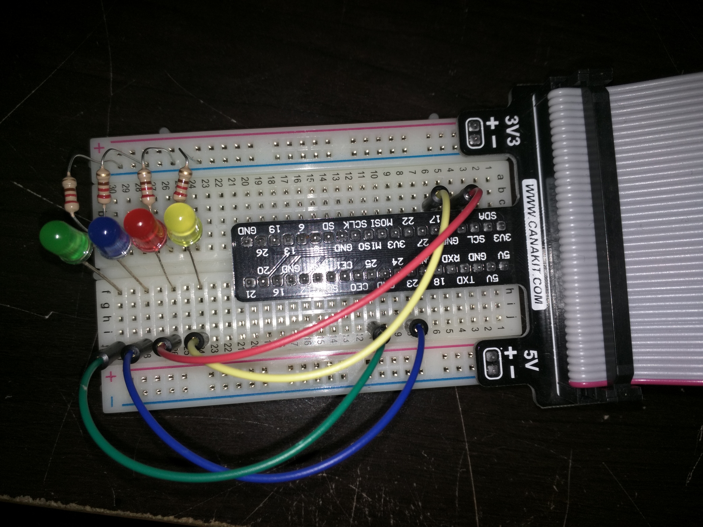

# rpi-light-controller
This is some old code I had on a Raspberry Pi 2, done circa 2014.  The goal of this project was to make a series of lights on a breadboard be controllable from a breadboard.

Tech used: [webiopi](http://webiopi.trouch.com/)

4 LED's are used: One yellow, one blue, one red, and one green.  They are each connected to the Raspberry Pi's I/O pins, and run to ground on the breadboard.

  

  

